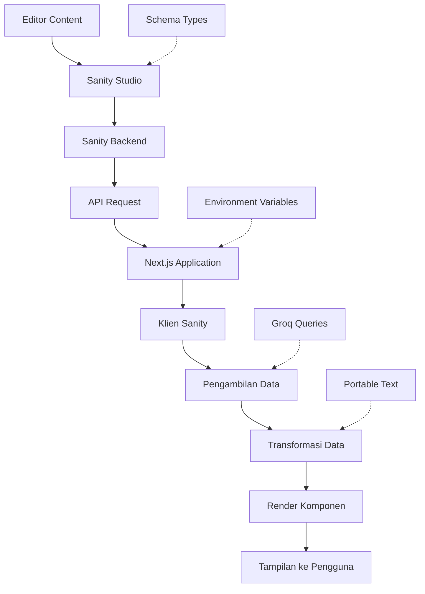

# Alur API dari Sanity ke Frontend

## Pendahuluan

Dokumen ini menjelaskan secara rinci bagaimana alur API dari Sanity ke frontend berlangsung dalam proyek ini. Proyek ini terdiri dari dua bagian utama:
- **Sanity Studio** (`bismillah`): Sebagai Content Management System (CMS) yang berfungsi sebagai backend untuk menyimpan dan mengelola konten
- **Frontend Next.js** (`next-sanity-mun`): Aplikasi web yang dibangun dengan Next.js yang mengambil data dari Sanity Studio melalui API dan menampilkannya kepada pengguna

## Diagram Alur



## File-file yang Terlibat

### 1. File Konfigurasi Sanity di Frontend

#### `src/lib/sanity.config.ts`
Berisi konfigurasi dasar seperti `projectId`, `dataset`, dan `apiVersion` yang digunakan untuk mengidentifikasi instance Sanity yang digunakan.

```typescript
// sanity.config.ts
export const projectId = process.env.NEXT_PUBLIC_SANITY_PROJECT_ID || 'ny2z8d3s'
export const dataset = process.env.NEXT_PUBLIC_SANITY_DATASET || 'production'
export const apiVersion = process.env.NEXT_PUBLIC_SANITY_API_VERSION || '2024-03-19'
export const token = process.env.SANITY_API_TOKEN || ''
```

#### `src/lib/sanity.client.ts`
Menginisialisasi klien Sanity yang digunakan untuk mengambil data dari API Sanity.

```typescript
import { createClient } from '@sanity/client'
import { projectId, dataset, apiVersion } from '@/lib/sanity.config'

// Klien reguler untuk mengambil konten publik
export const sanityClient = createClient({
  projectId: projectId || process.env.NEXT_PUBLIC_SANITY_PROJECT_ID || 'ny2z8d3s',
  dataset: dataset || process.env.NEXT_PUBLIC_SANITY_DATASET || 'production',
  apiVersion,
  useCdn: true, // Set to true for public content to improve performance
  perspective: 'published', // Only fetch published content
  timeout: 60000, // 60 second timeout for slower networks
})

// Klien untuk mode pratinjau
export const previewClient = createClient({
  projectId: projectId || process.env.NEXT_PUBLIC_SANITY_PROJECT_ID || 'ny2z8d3s',
  dataset: dataset || process.env.NEXT_PUBLIC_SANITY_DATASET || 'production',
  apiVersion,
  token: process.env.SANITY_API_TOKEN || undefined, // Only for preview mode
  useCdn: false,
  timeout: 60000, // 60 second timeout for slower networks
})
```

#### `src/lib/sanity.image.ts`
Mengonfigurasi pembangun URL gambar Sanity yang digunakan untuk mengambil dan mengoptimalkan gambar dari Sanity.

```typescript
import { createImageUrlBuilder } from '@sanity/image-url'
import { projectId, dataset } from '@/lib/sanity.config'

const imageBuilder = createImageUrlBuilder({
  projectId: projectId || '',
  dataset: dataset || ''
})

export const urlForImage = (source: any) => {
  return imageBuilder?.image(source).auto('format').fit('max')
}
```

### 2. File-file Query dan Pengambilan Data

#### `src/app/articles/page.tsx`
Contoh halaman yang mengambil dan menampilkan data artikel dari Sanity.

```typescript
import { groq } from 'next-sanity';
import { sanityClient } from '@/lib/sanity.client';
import Link from 'next/link';
import { urlForImage } from '@/lib/sanity.image';
import { PortableText } from '@portabletext/react';

// Query untuk mengambil artikel
const ARTICLES_BY_PAGE_QUERY = (start: number, end: number) => groq`
  *[_type == "article"] {
    _id,
    title,
    "slug": slug.current,
    publishedAt,
    excerpt,
    mainImage {
      asset->{
        _id,
        url
      },
      alt
    }
  } | order(publishedAt desc)[${start}..${end}]
`;
```

#### `src/app/articles/[slug]/page.tsx`
Contoh halaman detail artikel yang mengambil data spesifik berdasarkan slug.

```typescript
// Query untuk mengambil artikel tunggal berdasarkan slug
const ARTICLE_QUERY = groq`
  *[_type == "article" && slug.current == $slug][0]{
    _id,
    _type,
    title,
    slug,
    publishedAt,
    excerpt,
    body,
    mainImage {
      asset->{
        _id,
        url
      },
      alt
    },
    author->{
      _id,
      name,
      "avatar": image.asset->url
    }
  }
`;

// Pengambilan data
export default async function ArticlePage({ params }: { params: Promise<{ slug: string }> }) {
  const { slug } = await params;

  let article: any = null;

  try {
    article = await sanityClient.fetch(ARTICLE_QUERY, { slug });
  } catch (error) {
    console.error(`Error fetching article with slug "${slug}":`, error);
  }

  // Render artikel
  return (
    <article>
      <header>
        <h1>{article.title}</h1>
        
      </header>
      <section>
        {article.body && <PortableText value={article.body} components={portableTextComponents} />}
      </section>
    </article>
  );
}
```

### 3. File-file Tampilan dan Transformasi Data

#### `src/components/PortableTextComponents.tsx`
Mendefinisikan bagaimana elemen-elemen Portable Text ditampilkan.

```typescript
import { PortableTextComponents } from '@portabletext/react';
import { urlForImage } from '@/lib/sanity.image';
import Image from 'next/image';

// Definisi komponen kustom untuk Portable Text
export const portableTextComponents: PortableTextComponents = {
  types: {
    image: ({ value }) => {
      // ...
    },
  },
  block: {
    h1: ({ children }) => <h1 className="text-3xl font-bold my-6">{children}</h1>,
    h2: ({ children }) => <h2 className="text-2xl font-bold my-5">{children}</h2>,
    // ...
  },
  marks: {
    strong: ({ children }) => <strong className="font-bold">{children}</strong>,
    em: ({ children }) => <em className="italic">{children}</em>,
    // ...
  },
};
```

#### `src/types/sanity.ts`
Mendefinisikan interface TypeScript untuk struktur data Sanity.

```typescript
export interface Article {
  _id: string;
  _type: string;
  title: string;
  slug: {
    current: string;
  };
  publishedAt: string;
  excerpt?: string;
  body: any[]; // Using any for PortableText compatibility
  mainImage?: SanityImageWithUrl;
  author?: Author;
  categories?: Array<{
    _ref: string;
    _type: 'reference';
  }>;
}
```

## Proses Pengambilan dan Tampilan Data

### 1. Inisialisasi Klien
Klien Sanity diinisialisasi dengan konfigurasi yang telah ditentukan, termasuk `projectId`, `dataset`, dan `apiVersion`.

### 2. Pembuatan Query Groq
Query Groq dibuat untuk mengambil data spesifik dari Sanity. Contoh:
```typescript
const ARTICLE_QUERY = groq`
  *[_type == "article" && slug.current == $slug][0]{
    _id,
    _type,
    title,
    slug,
    publishedAt,
    excerpt,
    body,
    mainImage {
      asset->{
        _id,
        url
      },
      alt
    },
    author->{
      _id,
      name,
      "avatar": image.asset->url
    }
  }
`;
```

### 3. Pengambilan Data
Data diambil dari Sanity menggunakan metode `fetch()` pada klien Sanity:
```typescript
article = await sanityClient.fetch(ARTICLE_QUERY, { slug });
```

### 4. Transformasi Data
Data yang diambil dari Sanity ditransformasi menjadi format yang sesuai untuk ditampilkan di frontend.

### 5. Tampilan Data
Data ditampilkan menggunakan komponen React/Next.js dengan bantuan Portable Text untuk konten kaya.

## Mode Pengambilan Data

### 1. Server-Side Rendering (SSR)
Data diambil di server saat permintaan halaman dibuat.

### 2. Incremental Static Regeneration (ISR)
Dengan opsi `revalidate`, halaman dapat diregenerasi secara berkala tanpa harus rebuild seluruh situs:
```typescript
export const revalidate = 30; // Revalidate every 30 seconds
```

## Keamanan dan Performa

### 1. CDN
Klien reguler menggunakan `useCdn: true` untuk mengambil konten publik dengan performa lebih baik.

### 2. Token API
Token hanya digunakan untuk mode pratinjau dan tidak diperlukan untuk mengambil konten publik.

### 3. Timeout
Timeout ditetapkan untuk mencegah permintaan yang terlalu lama:
```typescript
timeout: 60000, // 60 second timeout for slower networks
```

## Kesimpulan

Integrasi Sanity dan Next.js dalam proyek ini menyediakan solusi headless CMS yang kuat dan fleksibel. Dengan menggunakan klien Sanity, query Groq, dan komponen Portable Text, pengembang dapat dengan mudah mengambil dan menampilkan konten yang kaya dari Sanity ke aplikasi Next.js sambil mempertahankan performa tinggi dan pengalaman pengguna yang baik.